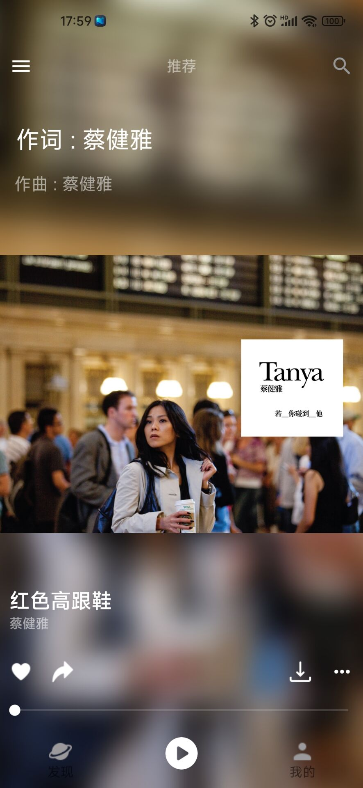
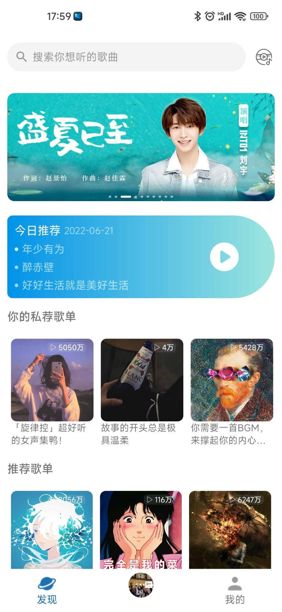
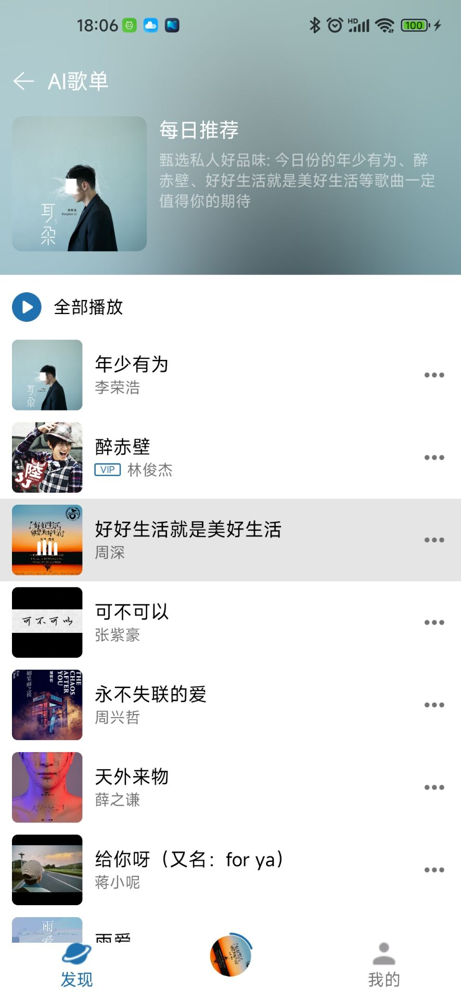
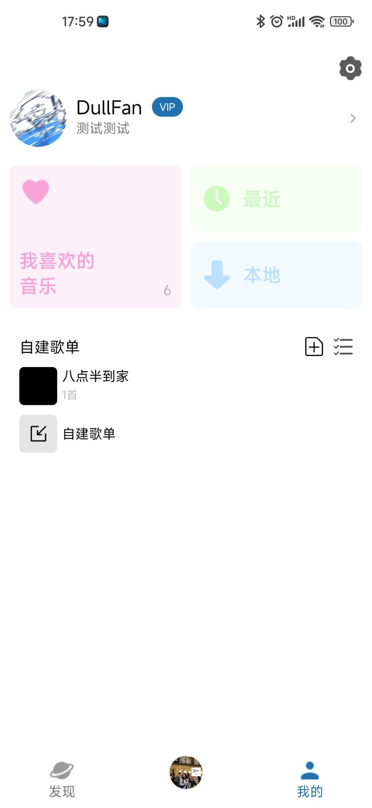
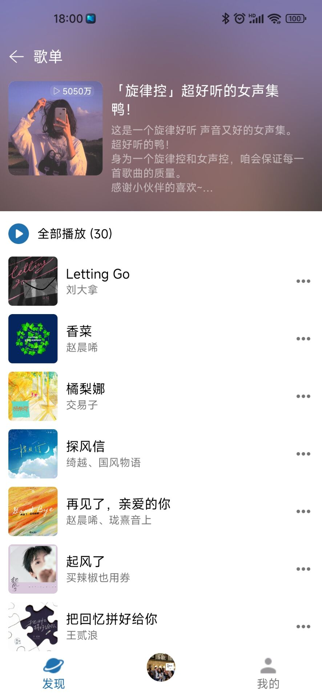
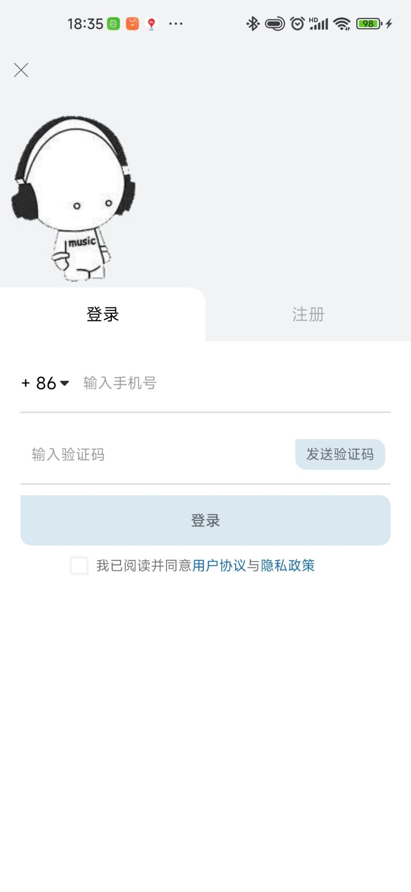

## 简介

使用网易云音乐API + 波点音乐UI实现的音乐项目。

后端是这位大佬的: https://github.com/Binaryify/NeteaseCloudMusicApi

## UI

## 特点
* 使用MVVM架构模式
* Retrofit2 + 协程完成的网络请求
* 内置换肤框架
* 使用了MotionLayout

## 更新日志

2022-6-6
* 完成了登录功能
* 添加了换肤框架

2022-6-11
* 完成了播放界面

2022-6-15
* 完成了发现模块

2022-6-21
* 完成了我的模块

## 还未完成的功能

* 双击添加到喜欢的音乐列表中
* 歌单详情中的更多事件
* 分享
* 点击歌词跳转到对应的歌词页面中
* 设置功能
* 换肤的皮肤包
* 用户是否是VIP没有判断
* 如果是非VIP听VIP歌只能播放30秒，还没添加提示

## 联系我

* QQ：2928527233
* CSDN：https://blog.csdn.net/weixin_51298509

